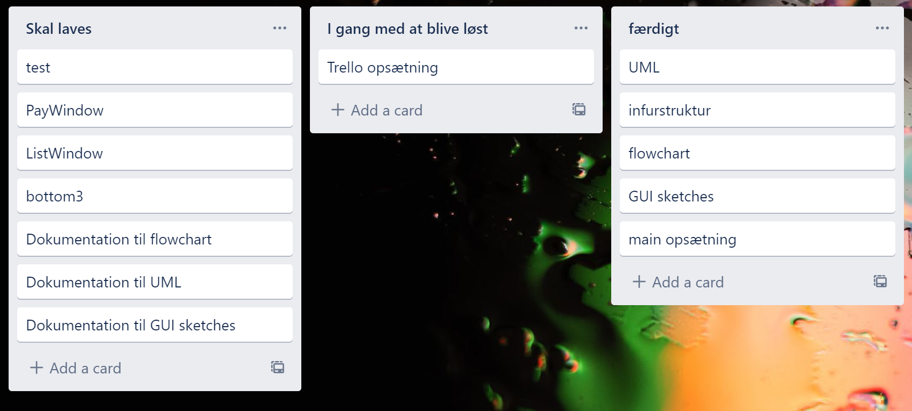

**Herunder kan man se dokumentation på strukturering af projektet.**

*Dette er vores strukturerings tegninger, efter projektet er færdiggjort.*

**GUI sketch:**

Gui sketchene ændrede sig meget under projektet. Der var funktioner der var brug for som ikke var tilstede i den først tegning.
Mange af Tk funktionerne der var planlagt, endte med at være korrekt, men der manglede bare features, vi ikke havde tænkt over.

**UML diagram:**

Efter vi var færdige med at skrive koden, har vi lavet en fornyet udgave af UMl diagrammerne, som tager udgangspunkt i 
de forskellige ændringer vi har lavet igennem vores proces. 

**Flowchart:**

Ved flowchartet kan man virkelig se udviklingen i programmet, og tilføjelsen af de andre vinduer.
Flowchartet er også farve sorteret efter de forskellige vinduer.

Trello Timeline viser hvordan vores arbejds fordeling, og overblik over arbejdsplan, har set ud igennem projektet.
**Trello Timeline:** https://trello.com/b/noTSdpqj/fodboldturgui

*Dette er vores strukturerings tegninger, fra da vi startede på projektet.*

**GUI sketch:**

Vi startede ud med at, lave et visuelt overblik over projektets design. Hvor vi fokuserede på objektorienteret design.
Derudover opdelte vi muligheder, for hvordan hver objekt kunnes løses (Knap, liste, dropdown, etc.)

**UML diagram:**

Vi har udarbejdet nogle UML diagrammer, som giver overblik over indholdet (variabler og metoder), som der er gjort brug 
af i de forskellige klasser.

**Flowchart:**

Flowchartet viser programmets flow mellem de forskellige vinduer.
Det er upræcists da man godt kan have flere vinduer åbent af gangen, men det skaber et overblik over brugeroplevelse.
